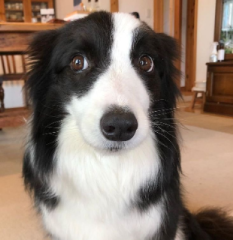

# hidog

Hidog turns any image into the bundled Border Collie target by rearranging the source image's pixels and animating them into place.



Try the web version at <https://alex6511.github.io/hidog/>.

## How to use

Use the controls at the top of the window to choose a source image, play or reverse the animation, switch between saved transformations, and create new ones. The default target is the bundled dog image, while the advanced editor still allows a custom target.

The output keeps the source image's colors: Hidog rearranges pixels rather than copying or generating the target image. You can also adjust:

| Setting | Description |
| --- | --- |
| Resolution | How many cells the images are divided into. Higher values preserve finer details but take longer to process. |
| Proximity importance | How strongly pixels prefer to stay near their original positions. Raise it for a subtler transformation. |
| Algorithm | `Optimal` finds a mathematically optimal assignment but is extremely slow at high resolutions; `Genetic` is the practical default. |

## Run locally

Install [Rust](https://www.rust-lang.org/tools/install), then run:

```text
cargo run --release
```

For the web build:

```text
rustup target add wasm32-unknown-unknown
cargo install --locked trunk
trunk serve --release --open
```

Pushes to `main` are deployed to GitHub Pages by the repository workflow.

## Credits

Hidog is based on [Spu7Nix/obamify](https://github.com/Spu7Nix/obamify) and remains available under the MIT license.
